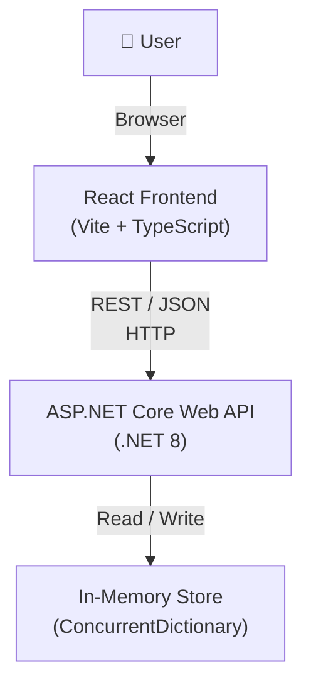
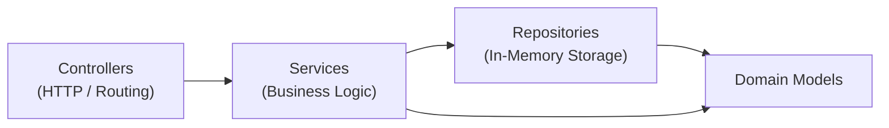
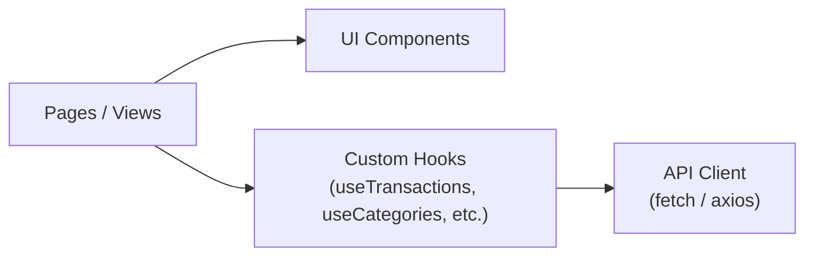

# Design Document — Expense Tracker

## Overview

Expense Tracker is a web application for personal finance management. The user interacts with a React frontend that communicates with a .NET backend via a REST API. The backend stores all data in memory (in-memory), which simplifies deployment and suits a single-user scenario with no persistence requirements across restarts.

> **Note on Requirement 8:** The data persistence requirement between sessions (Requirement 8) is not implemented in this version — the store is in-memory. Data is reset on server restart. If persistence is needed in the future, it is sufficient to replace the in-memory repository with a database-backed implementation without changing the rest of the architecture.

### Key Goals

- A simple and clear UI for adding, editing, and deleting transactions
- Filtering and pagination of transaction history
- Category management
- Analytics: balance and period-based reports

---

## Architecture

The application consists of two independent processes communicating over HTTP.



### Backend Layers



| Layer | Responsibility |
|---|---|
| **Controllers** | HTTP routing, input DTO validation, forming HTTP responses |
| **Services** | Business logic: balance calculation, report aggregation, business rule enforcement |
| **Repositories** | Storing and retrieving data in memory |
| **Domain Models** | Pure C# classes with no infrastructure dependencies |

### Frontend Layers



---

## Components and Interfaces

### REST API

Base URL: `/api`

#### Transactions

| Method | Path | Description |
|---|---|---|
| `GET` | `/api/transactions` | List transactions with filters and pagination |
| `POST` | `/api/transactions` | Create a transaction |
| `PUT` | `/api/transactions/{id}` | Update a transaction |
| `DELETE` | `/api/transactions/{id}` | Delete a transaction |

**Query parameters for `GET /api/transactions`:**

| Parameter | Type | Description |
|---|---|---|
| `dateFrom` | `string (ISO 8601)` | Period start (inclusive) |
| `dateTo` | `string (ISO 8601)` | Period end (inclusive) |
| `categoryId` | `string (GUID)` | Filter by category |
| `type` | `"income" \| "expense"` | Filter by type |
| `page` | `int` | Page number (starting from 1) |
| `pageSize` | `int` | Page size |

#### Categories

| Method | Path | Description |
|---|---|---|
| `GET` | `/api/categories` | List all categories |
| `POST` | `/api/categories` | Create a category |
| `PUT` | `/api/categories/{id}` | Rename a category |
| `DELETE` | `/api/categories/{id}` | Delete a category |

#### Analytics

| Method | Path | Description |
|---|---|---|
| `GET` | `/api/balance` | Current balance (optional: `dateFrom`, `dateTo`) |
| `GET` | `/api/reports` | Report for a period (`dateFrom`, `dateTo` — required) |

### DTO (Data Transfer Objects)

#### `CreateTransactionRequest`
```csharp
public record CreateTransactionRequest(
    string Type,          // "income" | "expense"
    decimal Amount,
    DateOnly Date,
    Guid CategoryId,
    string? Description
);
```

#### `UpdateTransactionRequest`
```csharp
public record UpdateTransactionRequest(
    string Type,
    decimal Amount,
    DateOnly Date,
    Guid CategoryId,
    string? Description
);
```

#### `TransactionResponse`
```csharp
public record TransactionResponse(
    Guid Id,
    string Type,
    decimal Amount,
    DateOnly Date,
    Guid CategoryId,
    string CategoryName,
    string? Description,
    DateTime CreatedAt
);
```

#### `PagedResult<T>`
```csharp
public record PagedResult<T>(
    IReadOnlyList<T> Items,
    int TotalCount,
    int Page,
    int PageSize
);
```

#### `CreateCategoryRequest` / `RenameCategoryRequest`
```csharp
public record CreateCategoryRequest(string Name);
public record RenameCategoryRequest(string Name);
```

#### `CategoryResponse`
```csharp
public record CategoryResponse(Guid Id, string Name);
```

#### `BalanceResponse`
```csharp
public record BalanceResponse(decimal TotalIncome, decimal TotalExpenses, decimal Balance);
```

#### `ReportResponse`
```csharp
public record ReportResponse(
    decimal TotalIncome,
    decimal TotalExpenses,
    decimal Balance,
    IReadOnlyList<CategoryBreakdown> ExpensesByCategory,
    IReadOnlyList<CategoryBreakdown> IncomeByCategory
);

public record CategoryBreakdown(Guid CategoryId, string CategoryName, decimal Total);
```

### Repository Interfaces (C#)

```csharp
public interface ITransactionRepository
{
    Transaction? GetById(Guid id);
    IReadOnlyList<Transaction> GetAll();
    void Add(Transaction transaction);
    void Update(Transaction transaction);
    void Delete(Guid id);
}

public interface ICategoryRepository
{
    Category? GetById(Guid id);
    Category? GetByName(string name);
    IReadOnlyList<Category> GetAll();
    bool HasTransactions(Guid categoryId);
    void Add(Category category);
    void Update(Category category);
    void Delete(Guid id);
}
```

### Service Interfaces (C#)

```csharp
public interface ITransactionService
{
    TransactionResponse Create(CreateTransactionRequest request);
    TransactionResponse Update(Guid id, UpdateTransactionRequest request);
    void Delete(Guid id);
    PagedResult<TransactionResponse> GetAll(TransactionFilter filter);
}

public interface ICategoryService
{
    CategoryResponse Create(CreateCategoryRequest request);
    CategoryResponse Rename(Guid id, RenameCategoryRequest request);
    void Delete(Guid id);
    IReadOnlyList<CategoryResponse> GetAll();
}

public interface IAnalyticsService
{
    BalanceResponse GetBalance(DateOnly? from, DateOnly? to);
    ReportResponse GetReport(DateOnly from, DateOnly to);
}
```

### Frontend Components (React)

| Component | Description |
|---|---|
| `TransactionList` | Transaction table with filters and pagination |
| `TransactionForm` | Form for creating / editing a transaction |
| `CategoryManager` | Category list with create, rename, and delete capabilities |
| `BalanceWidget` | Current balance widget |
| `ReportView` | Period report: totals and category breakdown |
| `FilterBar` | Filter panel (period, category, type) |

---

## Data Models

### Domain Models (C#)

```csharp
public class Transaction
{
    public Guid Id { get; init; } = Guid.NewGuid();
    public TransactionType Type { get; set; }
    public decimal Amount { get; set; }          // > 0
    public DateOnly Date { get; set; }
    public Guid CategoryId { get; set; }
    public string? Description { get; set; }
    public DateTime CreatedAt { get; init; } = DateTime.UtcNow;
}

public enum TransactionType { Income, Expense }

public class Category
{
    public Guid Id { get; init; } = Guid.NewGuid();
    public string Name { get; set; } = string.Empty;
}
```

### In-Memory Storage

```csharp
public class InMemoryTransactionRepository : ITransactionRepository
{
    private readonly ConcurrentDictionary<Guid, Transaction> _store = new();
    // ...
}

public class InMemoryCategoryRepository : ICategoryRepository
{
    private readonly ConcurrentDictionary<Guid, Category> _store = new();
    // ...
}
```

Data lives in a `ConcurrentDictionary` for thread-safe access. Both repositories are registered as `Singleton` in the ASP.NET Core DI container.

### Frontend Models (TypeScript)

```typescript
export type TransactionType = 'income' | 'expense';

export interface Transaction {
  id: string;
  type: TransactionType;
  amount: number;
  date: string;          // ISO 8601 date string
  categoryId: string;
  categoryName: string;
  description?: string;
  createdAt: string;
}

export interface Category {
  id: string;
  name: string;
}

export interface BalanceResponse {
  totalIncome: number;
  totalExpenses: number;
  balance: number;
}

export interface ReportResponse {
  totalIncome: number;
  totalExpenses: number;
  balance: number;
  expensesByCategory: CategoryBreakdown[];
  incomeByCategory: CategoryBreakdown[];
}

export interface CategoryBreakdown {
  categoryId: string;
  categoryName: string;
  total: number;
}

export interface PagedResult<T> {
  items: T[];
  totalCount: number;
  page: number;
  pageSize: number;
}
```

### Transaction Filter Model

```csharp
public record TransactionFilter(
    DateOnly? DateFrom,
    DateOnly? DateTo,
    Guid? CategoryId,
    TransactionType? Type,
    int Page = 1,
    int PageSize = 20
);
```

---

## Correctness Properties

*A property is a characteristic or behavior that should hold true across all valid executions of a system — essentially, a formal statement about what the system should do. Properties serve as the bridge between human-readable specifications and machine-verifiable correctness guarantees.*

### Property 1: Transaction Create — Round-Trip

*For any* valid transaction (type, positive amount, date, existing category, optional description), after it is created, a request to retrieve the transaction list SHALL return the transaction with the same fields, including the description.

**Validates: Requirements 1.1, 1.5**

---

### Property 2: Invalid Transactions Are Rejected

*For any* transaction with a missing required field (type, amount, date, category) or an amount ≤ 0, the system SHALL return a validation error and the transaction list SHALL remain unchanged.

**Validates: Requirements 1.2, 1.3, 2.3**

---

### Property 3: Update Preserves the Identifier

*For any* existing transaction and any set of valid updated fields, after the update the transaction SHALL have the same `id` but new values for all updated fields.

**Validates: Requirements 2.1**

---

### Property 4: Delete Removes the Transaction from the List

*For any* existing transaction, after it is deleted, a request to retrieve the transaction list SHALL NOT contain that transaction.

**Validates: Requirements 3.1**

---

### Property 5: Transaction List Is Sorted by Date Descending

*For any* set of transactions, the returned list SHALL be sorted by date in descending order (most recent first).

**Validates: Requirements 4.1**

---

### Property 6: Period Filter Returns Only Transactions Within the Range

*For any* period [dateFrom, dateTo] and any set of transactions, all transactions in the response SHALL have a date within the specified period (inclusive).

**Validates: Requirements 4.2**

---

### Property 7: Category and Type Filter Returns Only Matching Transactions

*For any* filter by category or type (or both), all transactions in the response SHALL match all specified filters.

**Validates: Requirements 4.3, 4.4**

---

### Property 8: Pagination Returns the Correct Slice

*For any* set of transactions, page size `pageSize`, and page number `page`, the response SHALL contain at most `pageSize` items, and `totalCount` SHALL equal the total number of transactions matching the filter.

**Validates: Requirements 4.5**

---

### Property 9: Category Create — Round-Trip

*For any* unique category name, after creation the category SHALL appear in the category list with an assigned unique identifier.

**Validates: Requirements 5.1**

---

### Property 10: Category Name Uniqueness

*For any* existing category with name N, attempting to create another category with the same name N SHALL return an error, and the total number of categories SHALL remain unchanged.

**Validates: Requirements 5.2**

---

### Property 11: Category Rename Is Reflected on Transactions

*For any* category and any new unique name, after renaming, all transactions associated with that category SHALL return the new category name.

**Validates: Requirements 5.3**

---

### Property 12: Balance Equals Income Minus Expenses

*For any* set of transactions and any period (or no period), the returned balance SHALL equal the sum of all income minus the sum of all expenses among transactions falling within the specified range.

**Validates: Requirements 6.1, 6.2**

---

### Property 13: Category Breakdown Covers All Transactions in the Period

*For any* period and any set of transactions, the sum of all values in `expensesByCategory` SHALL equal `totalExpenses`, and the sum of all values in `incomeByCategory` SHALL equal `totalIncome`.

**Validates: Requirements 7.1, 7.2, 7.3**

---

### Property 14: DTO Serialisation — Round-Trip

*For any* valid `Transaction` or `Category` object, serialising to JSON and then deserialising SHALL return an object equivalent to the original in all fields.

**Validates: Requirements 8.4**

---

## Error Handling

### HTTP Response Codes

| Situation | HTTP Code |
|---|---|
| Successful create | `201 Created` |
| Successful read | `200 OK` |
| Successful update | `200 OK` |
| Successful delete | `204 No Content` |
| Validation error | `400 Bad Request` |
| Resource not found | `404 Not Found` |
| Conflict (duplicate category name) | `409 Conflict` |
| Business rule violation (deleting a category with transactions) | `422 Unprocessable Entity` |
| Internal server error | `500 Internal Server Error` |

### Error Format

```json
{
  "error": "VALIDATION_ERROR",
  "message": "Amount must be a positive number.",
  "details": {
    "field": "amount",
    "value": -50
  }
}
```

### Error Handling Strategy

**Backend:**
- Input DTO validation via FluentValidation in the controller layer
- Business errors (not found, conflict) are thrown as custom exceptions from the service layer
- A global `ExceptionHandlerMiddleware` catches exceptions and produces a uniform JSON response

**Frontend:**
- A centralised API client intercepts HTTP errors and normalises them into a single `ApiError` type
- Components display inline errors for forms and toast notifications for delete/update operations
- Loading and error state is managed through custom hooks

---

## Testing Strategy

### Backend

**Unit tests (xUnit + FluentAssertions):**
- Service layer: testing business logic with mock repositories (Moq)
- Validation: checking all boundary conditions for input DTOs
- Analytics: balance calculation and report aggregation

**Property-based tests (FsCheck or CsCheck):**
- Minimum 100 iterations per test
- Each test is annotated with a comment: `// Feature: expense-tracker, Property N: <text>`
- Cover properties 1–12 described in the Correctness Properties section

**Integration tests (WebApplicationFactory):**
- Full HTTP cycle via `TestServer` with a real in-memory store
- Verifying routing correctness, JSON serialisation, and HTTP response codes

### Frontend

**Unit tests (Vitest + React Testing Library):**
- Form components: testing validation and data submission
- Hooks: testing loading state, errors, and successful responses with a mock API

**E2E tests (Playwright, optional):**
- Core user scenarios: adding a transaction, viewing balance, filtering

### Testing Balance

- Property-based tests cover a wide range of inputs and surface edge cases
- Unit tests focus on specific examples and integration points
- Integration tests verify the correctness of the HTTP layer and serialisation
