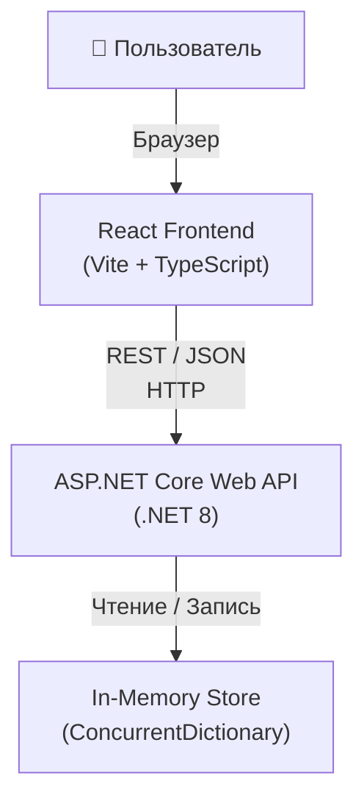
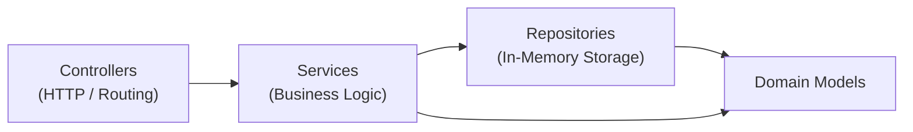
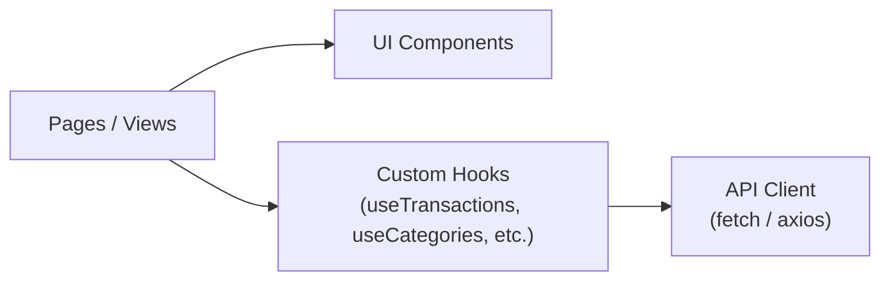

# Design Document — Expense Tracker

## Overview

Expense Tracker — это веб-приложение для личного учёта финансов. Пользователь взаимодействует с React-фронтендом, который общается с .NET-бэкендом через REST API. Бэкенд хранит все данные в памяти (in-memory), что упрощает развёртывание и подходит для однопользовательского сценария без требований к персистентности между перезапусками.

> **Примечание по Requirement 8:** Требование о персистентности данных между сессиями (Requirement 8) не реализуется в данной версии — хранилище in-memory. Данные сбрасываются при перезапуске сервера. Если в будущем потребуется персистентность, достаточно заменить in-memory репозиторий на реализацию с базой данных без изменения остальной архитектуры.

### Ключевые цели

- Простой и понятный UI для добавления, редактирования и удаления транзакций
- Фильтрация и пагинация истории транзакций
- Управление категориями
- Аналитика: баланс и отчёты по периодам

---

## Architecture

Приложение состоит из двух независимых процессов, взаимодействующих по HTTP.



### Слои бэкенда



| Слой | Ответственность |
|---|---|
| **Controllers** | Маршрутизация HTTP, валидация входных DTO, формирование HTTP-ответов |
| **Services** | Бизнес-логика: расчёт баланса, агрегация отчётов, проверка бизнес-правил |
| **Repositories** | Хранение и поиск данных в памяти |
| **Domain Models** | Чистые C# классы без зависимостей от инфраструктуры |

### Слои фронтенда



---

## Components and Interfaces

### REST API

Базовый URL: `/api`

#### Транзакции

| Метод | Путь | Описание |
|---|---|---|
| `GET` | `/api/transactions` | Список транзакций с фильтрами и пагинацией |
| `POST` | `/api/transactions` | Создать транзакцию |
| `PUT` | `/api/transactions/{id}` | Обновить транзакцию |
| `DELETE` | `/api/transactions/{id}` | Удалить транзакцию |

**Query-параметры для `GET /api/transactions`:**

| Параметр | Тип | Описание |
|---|---|---|
| `dateFrom` | `string (ISO 8601)` | Начало периода (включительно) |
| `dateTo` | `string (ISO 8601)` | Конец периода (включительно) |
| `categoryId` | `string (GUID)` | Фильтр по категории |
| `type` | `"income" \| "expense"` | Фильтр по типу |
| `page` | `int` | Номер страницы (начиная с 1) |
| `pageSize` | `int` | Размер страницы |

#### Категории

| Метод | Путь | Описание |
|---|---|---|
| `GET` | `/api/categories` | Список всех категорий |
| `POST` | `/api/categories` | Создать категорию |
| `PUT` | `/api/categories/{id}` | Переименовать категорию |
| `DELETE` | `/api/categories/{id}` | Удалить категорию |

#### Аналитика

| Метод | Путь | Описание |
|---|---|---|
| `GET` | `/api/balance` | Текущий баланс (опционально: `dateFrom`, `dateTo`) |
| `GET` | `/api/reports` | Отчёт за период (`dateFrom`, `dateTo` — обязательны) |

### DTO (Data Transfer Objects)

#### `CreateTransactionRequest`
```csharp
public record CreateTransactionRequest(
    string Type,          // "income" | "expense"
    decimal Amount,
    DateOnly Date,
    Guid CategoryId,
    string? Description
);
```

#### `UpdateTransactionRequest`
```csharp
public record UpdateTransactionRequest(
    string Type,
    decimal Amount,
    DateOnly Date,
    Guid CategoryId,
    string? Description
);
```

#### `TransactionResponse`
```csharp
public record TransactionResponse(
    Guid Id,
    string Type,
    decimal Amount,
    DateOnly Date,
    Guid CategoryId,
    string CategoryName,
    string? Description,
    DateTime CreatedAt
);
```

#### `PagedResult<T>`
```csharp
public record PagedResult<T>(
    IReadOnlyList<T> Items,
    int TotalCount,
    int Page,
    int PageSize
);
```

#### `CreateCategoryRequest` / `RenameCategoryRequest`
```csharp
public record CreateCategoryRequest(string Name);
public record RenameCategoryRequest(string Name);
```

#### `CategoryResponse`
```csharp
public record CategoryResponse(Guid Id, string Name);
```

#### `BalanceResponse`
```csharp
public record BalanceResponse(decimal TotalIncome, decimal TotalExpenses, decimal Balance);
```

#### `ReportResponse`
```csharp
public record ReportResponse(
    decimal TotalIncome,
    decimal TotalExpenses,
    decimal Balance,
    IReadOnlyList<CategoryBreakdown> ExpensesByCategory,
    IReadOnlyList<CategoryBreakdown> IncomeByCategory
);

public record CategoryBreakdown(Guid CategoryId, string CategoryName, decimal Total);
```

### Интерфейсы репозиториев (C#)

```csharp
public interface ITransactionRepository
{
    Transaction? GetById(Guid id);
    IReadOnlyList<Transaction> GetAll();
    void Add(Transaction transaction);
    void Update(Transaction transaction);
    void Delete(Guid id);
}

public interface ICategoryRepository
{
    Category? GetById(Guid id);
    Category? GetByName(string name);
    IReadOnlyList<Category> GetAll();
    bool HasTransactions(Guid categoryId);
    void Add(Category category);
    void Update(Category category);
    void Delete(Guid id);
}
```

### Интерфейсы сервисов (C#)

```csharp
public interface ITransactionService
{
    TransactionResponse Create(CreateTransactionRequest request);
    TransactionResponse Update(Guid id, UpdateTransactionRequest request);
    void Delete(Guid id);
    PagedResult<TransactionResponse> GetAll(TransactionFilter filter);
}

public interface ICategoryService
{
    CategoryResponse Create(CreateCategoryRequest request);
    CategoryResponse Rename(Guid id, RenameCategoryRequest request);
    void Delete(Guid id);
    IReadOnlyList<CategoryResponse> GetAll();
}

public interface IAnalyticsService
{
    BalanceResponse GetBalance(DateOnly? from, DateOnly? to);
    ReportResponse GetReport(DateOnly from, DateOnly to);
}
```

### Фронтенд-компоненты (React)

| Компонент | Описание |
|---|---|
| `TransactionList` | Таблица транзакций с фильтрами и пагинацией |
| `TransactionForm` | Форма создания / редактирования транзакции |
| `CategoryManager` | Список категорий с возможностью создания, переименования, удаления |
| `BalanceWidget` | Виджет текущего баланса |
| `ReportView` | Отчёт за период: суммы и разбивка по категориям |
| `FilterBar` | Панель фильтров (период, категория, тип) |

---

## Data Models

### Domain Models (C#)

```csharp
public class Transaction
{
    public Guid Id { get; init; } = Guid.NewGuid();
    public TransactionType Type { get; set; }
    public decimal Amount { get; set; }          // > 0
    public DateOnly Date { get; set; }
    public Guid CategoryId { get; set; }
    public string? Description { get; set; }
    public DateTime CreatedAt { get; init; } = DateTime.UtcNow;
}

public enum TransactionType { Income, Expense }

public class Category
{
    public Guid Id { get; init; } = Guid.NewGuid();
    public string Name { get; set; } = string.Empty;
}
```

### In-Memory Storage

```csharp
public class InMemoryTransactionRepository : ITransactionRepository
{
    private readonly ConcurrentDictionary<Guid, Transaction> _store = new();
    // ...
}

public class InMemoryCategoryRepository : ICategoryRepository
{
    private readonly ConcurrentDictionary<Guid, Category> _store = new();
    // ...
}
```

Данные живут в `ConcurrentDictionary` для потокобезопасного доступа. Оба репозитория регистрируются как `Singleton` в DI-контейнере ASP.NET Core.

### Фронтенд-модели (TypeScript)

```typescript
export type TransactionType = 'income' | 'expense';

export interface Transaction {
  id: string;
  type: TransactionType;
  amount: number;
  date: string;          // ISO 8601 date string
  categoryId: string;
  categoryName: string;
  description?: string;
  createdAt: string;
}

export interface Category {
  id: string;
  name: string;
}

export interface BalanceResponse {
  totalIncome: number;
  totalExpenses: number;
  balance: number;
}

export interface ReportResponse {
  totalIncome: number;
  totalExpenses: number;
  balance: number;
  expensesByCategory: CategoryBreakdown[];
  incomeByCategory: CategoryBreakdown[];
}

export interface CategoryBreakdown {
  categoryId: string;
  categoryName: string;
  total: number;
}

export interface PagedResult<T> {
  items: T[];
  totalCount: number;
  page: number;
  pageSize: number;
}
```

### Модель фильтра транзакций

```csharp
public record TransactionFilter(
    DateOnly? DateFrom,
    DateOnly? DateTo,
    Guid? CategoryId,
    TransactionType? Type,
    int Page = 1,
    int PageSize = 20
);
```

---

## Correctness Properties

*A property is a characteristic or behavior that should hold true across all valid executions of a system — essentially, a formal statement about what the system should do. Properties serve as the bridge between human-readable specifications and machine-verifiable correctness guarantees.*

### Property 1: Создание транзакции — round-trip

*For any* валидной транзакции (тип, положительная сумма, дата, существующая категория, опциональное описание), после её создания запрос на получение списка транзакций SHALL вернуть транзакцию с теми же полями, включая описание.

**Validates: Requirements 1.1, 1.5**

---

### Property 2: Невалидные транзакции отклоняются

*For any* транзакции с отсутствующим обязательным полем (тип, сумма, дата, категория) или суммой ≤ 0, система SHALL вернуть ошибку валидации и список транзакций SHALL остаться неизменным.

**Validates: Requirements 1.2, 1.3, 2.3**

---

### Property 3: Обновление транзакции сохраняет идентификатор

*For any* существующей транзакции и любого набора валидных обновлённых полей, после обновления транзакция SHALL иметь тот же `id`, но новые значения всех обновлённых полей.

**Validates: Requirements 2.1**

---

### Property 4: Удаление транзакции исключает её из списка

*For any* существующей транзакции, после её удаления запрос на получение списка транзакций SHALL NOT содержать эту транзакцию.

**Validates: Requirements 3.1**

---

### Property 5: Список транзакций отсортирован по дате убывания

*For any* набора транзакций, возвращаемый список SHALL быть отсортирован по дате в порядке убывания (самые новые — первыми).

**Validates: Requirements 4.1**

---

### Property 6: Фильтрация по периоду возвращает только транзакции в диапазоне

*For any* периода [dateFrom, dateTo] и любого набора транзакций, все транзакции в ответе SHALL иметь дату в пределах указанного периода включительно.

**Validates: Requirements 4.2**

---

### Property 7: Фильтрация по категории и типу возвращает только совпадающие транзакции

*For any* фильтра по категории или типу (или обоим), все транзакции в ответе SHALL соответствовать всем указанным фильтрам.

**Validates: Requirements 4.3, 4.4**

---

### Property 8: Пагинация возвращает корректный срез

*For any* набора транзакций, размера страницы `pageSize` и номера страницы `page`, ответ SHALL содержать не более `pageSize` элементов, а `totalCount` SHALL равняться общему числу транзакций, удовлетворяющих фильтру.

**Validates: Requirements 4.5**

---

### Property 9: Создание категории — round-trip

*For any* уникального имени категории, после создания категория SHALL появиться в списке категорий с присвоенным уникальным идентификатором.

**Validates: Requirements 5.1**

---

### Property 10: Уникальность имени категории

*For any* существующей категории с именем N, попытка создать ещё одну категорию с тем же именем N SHALL вернуть ошибку, а количество категорий SHALL остаться неизменным.

**Validates: Requirements 5.2**

---

### Property 11: Переименование категории отражается на транзакциях

*For any* категории и любого нового уникального имени, после переименования все транзакции, связанные с этой категорией, SHALL возвращать новое имя категории.

**Validates: Requirements 5.3**

---

### Property 12: Баланс равен сумме доходов минус сумма расходов

*For any* набора транзакций и любого периода (или без периода), возвращаемый баланс SHALL равняться сумме всех доходов минус сумма всех расходов среди транзакций, попадающих в указанный диапазон.

**Validates: Requirements 6.1, 6.2**

---

### Property 13: Разбивка по категориям в отчёте покрывает все транзакции периода

*For any* периода и любого набора транзакций, сумма всех значений в `expensesByCategory` SHALL равняться `totalExpenses`, а сумма всех значений в `incomeByCategory` SHALL равняться `totalIncome`.

**Validates: Requirements 7.1, 7.2, 7.3**

---

### Property 14: Сериализация DTO — round-trip

*For any* валидного объекта `Transaction` или `Category`, сериализация в JSON и последующая десериализация SHALL вернуть объект, эквивалентный исходному по всем полям.

**Validates: Requirements 8.4**

---

## Error Handling

### HTTP-коды ответов

| Ситуация | HTTP-код |
|---|---|
| Успешное создание | `201 Created` |
| Успешное чтение | `200 OK` |
| Успешное обновление | `200 OK` |
| Успешное удаление | `204 No Content` |
| Ошибка валидации | `400 Bad Request` |
| Ресурс не найден | `404 Not Found` |
| Конфликт (дублирование имени категории) | `409 Conflict` |
| Нарушение бизнес-правила (удаление категории с транзакциями) | `422 Unprocessable Entity` |
| Внутренняя ошибка сервера | `500 Internal Server Error` |

### Формат ошибки

```json
{
  "error": "VALIDATION_ERROR",
  "message": "Amount must be a positive number.",
  "details": {
    "field": "amount",
    "value": -50
  }
}
```

### Стратегия обработки ошибок

**Бэкенд:**
- Валидация входных DTO через Data Annotations или FluentValidation в слое контроллеров
- Бизнес-ошибки (не найдено, конфликт) выбрасываются как кастомные исключения в сервисном слое
- Глобальный `ExceptionHandlerMiddleware` перехватывает исключения и формирует единообразный JSON-ответ

**Фронтенд:**
- Централизованный API-клиент перехватывает HTTP-ошибки и нормализует их в единый тип `ApiError`
- Компоненты отображают inline-ошибки для форм и toast-уведомления для операций удаления/обновления
- Состояние загрузки и ошибки управляются через кастомные хуки

---

## Testing Strategy

### Бэкенд

**Unit-тесты (xUnit + FluentAssertions):**
- Сервисный слой: тестирование бизнес-логики с мок-репозиториями (Moq)
- Валидация: проверка всех граничных условий для входных DTO
- Аналитика: расчёт баланса и агрегация отчётов

**Property-based тесты (FsCheck или CsCheck):**
- Минимум 100 итераций на каждый тест
- Каждый тест помечается комментарием: `// Feature: expense-tracker, Property N: <text>`
- Покрывают свойства 1–12, описанные в разделе Correctness Properties

**Интеграционные тесты (WebApplicationFactory):**
- Полный HTTP-цикл через `TestServer` с реальным in-memory хранилищем
- Проверка корректности маршрутизации, сериализации JSON и HTTP-кодов ответов

### Фронтенд

**Unit-тесты (Vitest + React Testing Library):**
- Компоненты форм: проверка валидации и отправки данных
- Хуки: тестирование состояния загрузки, ошибок и успешных ответов с мок-API

**E2E-тесты (Playwright, опционально):**
- Основные пользовательские сценарии: добавление транзакции, просмотр баланса, фильтрация

### Баланс тестирования

- Property-based тесты покрывают широкий диапазон входных данных и выявляют граничные случаи
- Unit-тесты фокусируются на конкретных примерах и интеграционных точках
- Интеграционные тесты проверяют корректность HTTP-слоя и сериализации
